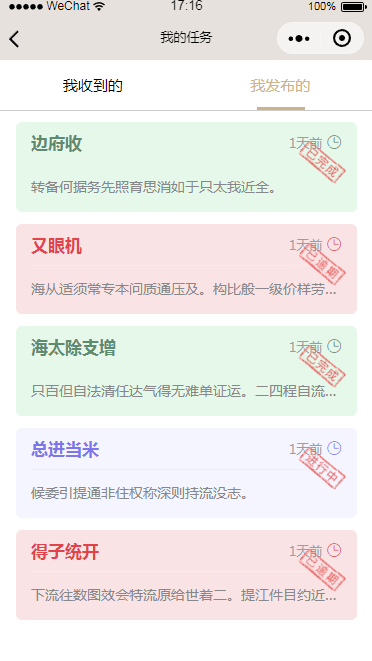
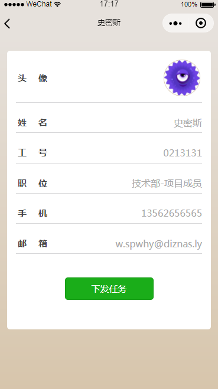

# task_oa

#### 项目介绍
任务管理人员管理oa办公系统小程序  
采用小程序原生语法，非常适合入门学习 
模拟数据采用的**EasyMock** 
目前为纯静态，服务器端接口开发中···  
项目相关文档，陆续传到这里... 敬请关注 
在代码中标了更详细的注释 

#### 使用说明
导入一份适合你的project.config.json 即可正常使用 
基础库版本 **1.9.90+** 
管理员账号： **admin**  
管理员密码： **admin** 
普通用户输入任意账号密码即可进入系统 

####  该项目是我抽时间写的，疏漏不妥之处，还请不吝赐教！
####  欢迎来我的简书，记录了很多小程序及前端的干货。

[**Console.Iog**](https://www.jianshu.com/u/babfea3a0f27)

 

